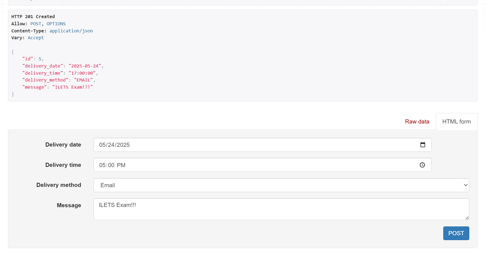
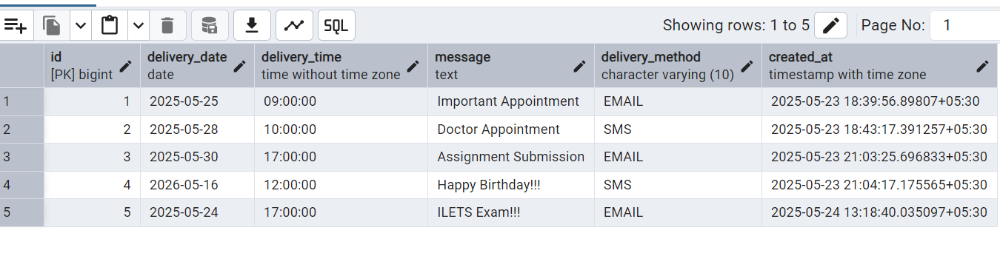

# Symplique
Assignment : Remind-me-later

A simple web app for scheduling reminders with a message, date, and time. Users can choose to be reminded via SMS or Email. This Django-based backend provides an API endpoint (POST /api/reminders/) to save reminders to a PostgreSQL database, with plans to support additional delivery methods in the future. The frontend, built by JS developers, offers a user-friendly interface for setting reminders. Note: Message delivery logic is not implemented in this backend.

To run the project:
1. Install venv and press .\myenv\Scripts\activate
2. cd remind_me_later
3. python manage.py runserver , then go to localhost and in url add 'http://127.0.0.1:8000/api/reminders'
4. Then enter details to set remainder

api/reminders/

Postgresql DB
